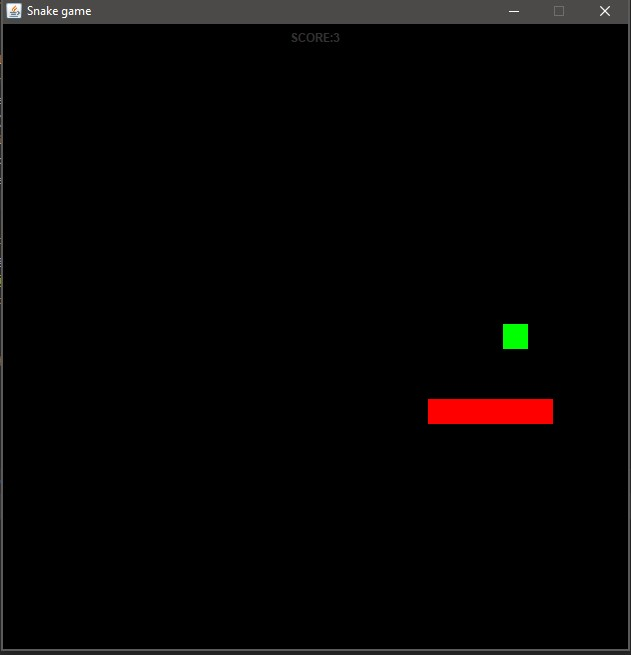

# snake_java
Snake game made using Java. GUI was made using Swing and for tests I used JUnit framework.
Some screenshots of the game:
Early game screenshot. As you can see the snake is super small and the score is quite low

Mid-game snake. The score increased and so did the length

End-game screen. Achieved either by hiting a wall or biting yourself

